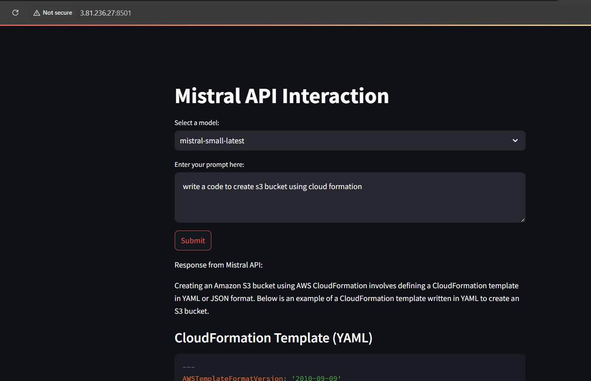

# Learning Streamlit 

## Table of Contents
1. [Basic Setup](#basic-setup)
2. [Core Components](#core-components)
3. [Basic Data Explorer App](#basic-data-explorer)
4. [Advanced Applications](#advanced-applications)
5. [Advanced GenAI Streamlit Web Applications](#advanced-genai-streamlit-web-Applications)

## Basic Setup
```python
pip install streamlit
```

## Core Components

### Text Elements
```python
import streamlit as st

# Creates main title with large text
st.title("Main Title")

# Creates section header with medium text
st.header("Header") 

# Creates subsection header with smaller text
st.subheader("Subheader")

# Displays plain text without formatting
st.text("Plain text")

# Renders markdown text with formatting
st.markdown("**Bold** and *italic*")
```

### Data Display
```python
import pandas as pd
import numpy as np

# Creates sample dataframe with random values
df = pd.DataFrame(np.random.randn(10, 2), columns=['A', 'B'])

# Shows interactive dataframe with sorting/filtering
st.dataframe(df)

# Shows static table view of dataframe
st.table(df)

# Displays JSON formatted data
st.json({'data': 'value'})
```

### Input Widgets
```python
# Creates text input field
name = st.text_input("Enter your name")

# Creates number input with range limits
age = st.number_input("Enter your age", min_value=0, max_value=120)

# Creates dropdown selection menu
choice = st.selectbox("Choose option", ["A", "B", "C"])

# Creates slider for value selection
slider_val = st.slider("Select value", 0, 100)
```

### Charts
```python
import matplotlib.pyplot as plt

# Creates dataframe for chart data
chart_data = pd.DataFrame(np.random.randn(20, 3), columns=['A', 'B', 'C'])

# Displays interactive line chart
st.line_chart(chart_data)

# Creates and displays matplotlib plot
fig, ax = plt.subplots()
ax.plot([1, 2, 3], [1, 2, 3])
st.pyplot(fig)
```

### Layout
```python
# Creates two equal columns
col1, col2 = st.columns(2)

# Content for first column
with col1:
    st.header("Column 1")
    st.write("Content for column 1")

# Content for second column
with col2:
    st.header("Column 2") 
    st.write("Content for column 2")

# Creates expandable section
with st.expander("Click to expand"):
    st.write("Hidden content here")
```

## Data Explorer Application
```python
import streamlit as st
import pandas as pd
import matplotlib.pyplot as plt

def data_explorer():
    # Creates app title
    st.title("Data Explorer")
    
    # Adds file upload widget
    uploaded_file = st.file_uploader("Upload CSV", type=['csv'])
    
    if uploaded_file:
        # Reads uploaded CSV file
        df = pd.read_csv(uploaded_file)
        
        # Shows data overview section
        st.header("Data Overview")
        st.write(f"Shape: {df.shape}")
        st.dataframe(df.head())
        
        # Creates column selector
        column = st.selectbox("Select column to analyze", df.columns)
        
        # Displays statistics for selected column
        st.header(f"Statistics for {column}")
        st.write(df[column].describe())
        
        # Creates histogram of selected column
        fig, ax = plt.subplots()
        df[column].hist(ax=ax)
        st.pyplot(fig)

# Main entry point of the application
if __name__ == "__main__":
    data_explorer()
```

## Advanced Applications

### Example 1: GenAI Streamlit Web App with Mistral API.

Mistral API provides access to generative AI models that can be used for tasks such as text generation etc.

**.env**

```env
MISTRAL_API_ENDPOINT="https://api.mistral.ai/v1/chat/completions"
MISTRAL_API_KEY=your_mistral_api_key
```

**app.py**

```python
# Import required libraries
import streamlit as st  # Web app framework
import requests  # HTTP requests
from dotenv import load_dotenv  # Environment variable management
import os  # Operating system interface

# Load environment variables from .env file
load_dotenv()

# Get API credentials from environment variables
MISTRAL_API_KEY = os.getenv('MISTRAL_API_KEY')  # Secure API key storage
MISTRAL_API_ENDPOINT = os.getenv('MISTRAL_API_ENDPOINT')  # API endpoint

def call_mistral_api(prompt, model):
    # Set request headers
    headers = {
        "Authorization": f"Bearer {MISTRAL_API_KEY}",  # API authentication
        "Content-Type": "application/json"  # Request format
    }
    
    # Configure API request parameters
    data = {
        "model": model,  # Selected AI model
        "messages": [{"role": "user", "content": prompt}],  # User input
        "max_tokens": 900  # Response length limit
    }
    
    # Send API request and handle response
    response = requests.post(MISTRAL_API_ENDPOINT, headers=headers, json=data)
    if response.status_code == 200:
        return response.json().get("choices", [{}])[0].get("message", {}).get("content", "")
    else:
        return f"Error: {response.status_code} - {response.text}"

# Create web interface
st.title("Mistral API Interaction")
model = st.selectbox("Select a model:", ["mistral-small-latest", "open-mistral-7b"])
prompt = st.text_area("Enter your prompt here:")

# Handle form submission
if st.button("Submit"):
    if prompt:
        response = call_mistral_api(prompt, model)
        st.write("Response from Mistral API:")
        st.write(response)
    else:
        st.write("Please enter a prompt.")
```

Screenshot of Streamlit Web App as shown in this workflow diagram:




## Best Practices
1. **Structure**
   - Organize code into functions
   - Use clear naming conventions
   - Implement proper error handling

2. **Performance**
   - Cache expensive computations using `@st.cache_data`
   - Optimize data loading
   - Use appropriate data types

3. **User Experience**
   - Add loading indicators
   - Provide clear feedback
   - Include input validation

4. **Security**
   - Never expose API keys in code
   - Validate user inputs
   - Handle sensitive data appropriately
   

## Running Applications
```bash
streamlit run app.py
```

## Advanced GenAI Streamlit Web Applications - Refer to these links 

1. RAG-DocuMind: Intelligent Document Analysis & Response Platform
https://github.com/GenAICloudDevOps/Gen-AI-Apps/tree/main/RAG-DocuMind

2. Prompt Engineering - SummarizeClassifyPredict
https://github.com/GenAICloudDevOps/Gen-AI-Apps/tree/main/AI-SummarizeClassifyPredict

3. Multi-Agent Collaboration using CrewAI - power of collaborative AI
https://github.com/GenAICloudDevOps/Gen-AI-Apps/tree/main/Multi-AgentCollaborationusingCrewAI


## Additional Resources
- [Streamlit Documentation](https://docs.streamlit.io/)
- [Streamlit Components](https://streamlit.io/components)
- [Example Gallery](https://streamlit.io/gallery)